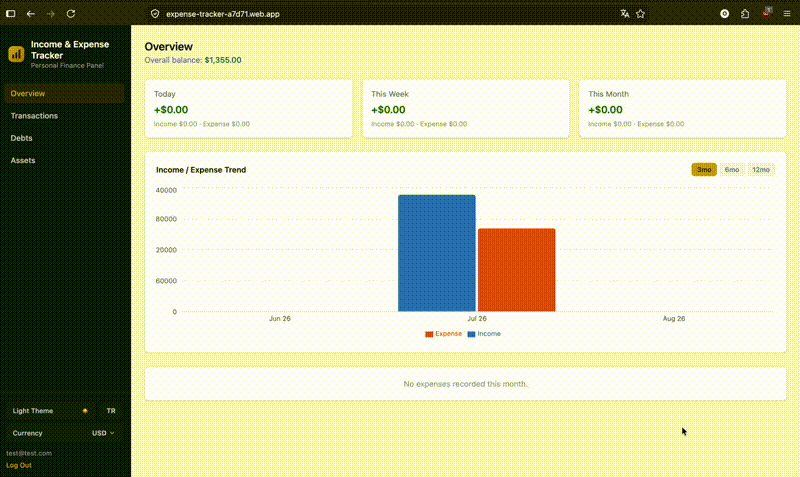

# Income & Expense Tracker

A personal finance tracker built with React and Firebase — manual income/expense
logging, debt & credit card tracking, gold/silver/foreign-currency holdings with
live valuation, multi-currency display, and analytics/reporting via Recharts.

**Live demo:** https://expense-tracker-a7d71.web.app

> The app itself is fully bilingual (Turkish/English, switchable from the UI) —
> the screenshots and copy in this README are just for the repo.



## Features

- **Transactions** — manual income/expense entries with category, description,
  date and a recurring flag; daily / weekly / monthly summaries.
- **Analytics** — category breakdown pie chart and a 3/6/12-month income vs.
  expense trend chart, both built with Recharts.
- **Debts & credit cards** — track a debt's total and remaining balance; making
  a payment automatically records it as an expense transaction linked back to
  the debt, while adding a new debt does not touch the overall balance (it's a
  liability record, not a cash movement).
- **Assets** — record holdings of gram gold, gram silver, USD, EUR, GBP or CHF;
  each holding's current value is computed from live exchange/gold rates and
  shown in whichever currency the user has selected.
- **Multi-currency display** — a single "base currency" selector (TRY, plus
  whichever of USD/EUR/GBP/CHF the rate provider returns). All data is stored
  in TRY; only the on-screen presentation is converted, with a safe fallback
  to TRY if live rates are unavailable.
- **Live market rates** — current USD/EUR and gold price widget (Turkish-market
  focused, shown only in the Turkish UI since the figures are TRY-denominated).
- **Authentication & per-user data isolation** — Firebase Auth (email/password)
  with Firestore Security Rules ensuring every user can only read/write their
  own transactions, debts and assets.
- **Responsive design** — a fixed sidebar on desktop, a bottom tab bar + a
  collapsible header menu on mobile/tablet.
- **Dark / light theme** and **Turkish / English UI**, both toggleable and
  persisted per device.

## Tech stack

- **React 19** — functional components and hooks throughout
- **Firebase v9+ Modular SDK** — Authentication + Cloud Firestore
- **Tailwind CSS v4**
- **Recharts** — charts and analytics
- **React Router v6** — client-side routing
- **Firebase Hosting** — deployment
- **Vite** — build tooling

## Project structure

```
src/
  components/   UI components, grouped by feature (auth, transactions, debts,
                assets, dashboard, layout)
  context/      React Context providers (auth, theme, language, currency)
  hooks/        Custom hooks (one per feature: useTransactions, useDebts,
                useAssets, useTheme, useLanguage, useCurrency, ...)
  services/     Firestore/Firebase access layer, isolated from UI components
  utils/        Formatting, date helpers, category/currency/asset-type definitions
  locales/      Turkish/English translation strings
  pages/        Route-level page components
```

## Getting started

1. Clone the repo and install dependencies:
   ```
   git clone https://github.com/onuresin/expense-tracker.git
   cd expense-tracker
   npm install
   ```
2. Create a Firebase project (Authentication with the Email/Password provider
   enabled, and a Cloud Firestore database), then copy `.env.example` to
   `.env.local` and fill in your web app's config values from the Firebase
   Console.
3. Publish Firestore Security Rules that scope every collection
   (`transactions`, `debts`, `assets`) to `request.auth.uid == resource.data.userId`
   for reads/updates/deletes and to `request.auth.uid == request.resource.data.userId`
   for creates, with a deny-all fallback for anything else.
4. Run the app locally:
   ```
   npm run dev
   ```
5. Build and deploy to Firebase Hosting:
   ```
   npm run build
   npx firebase-tools deploy --only hosting
   ```

## Notes on scope

This is a portfolio/demo project, intentionally kept at MVP scope: manual data
entry only (no bank/broker API integrations), a single display-currency
conversion rather than true per-transaction multi-currency accounting, and no
historical exchange-rate tracking for past transactions.
